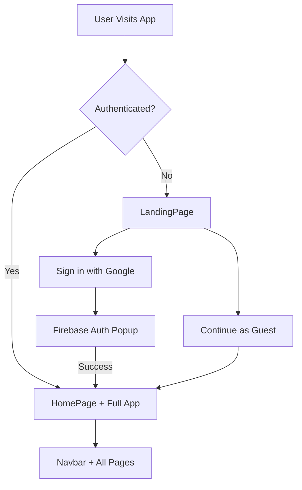

# 🏟️ Smart Stadium — Web App

> A cloud-based web application that helps stadium visitors avoid crowds, skip queues, order food smartly, stay safe, and have fun — all from their phone.

🔗 **Live Demo:** [physical-event-experience](https://physical-event-experience-731791825163.us-central1.run.app)

---

## 📋 Overview

Smart Stadium is an AI-powered live event companion that optimizes the stadium experience using real-time crowd simulation, smart routing, and gamification — built as a Progressive Web App with a premium dark-mode interface.

### One-Line Summary
*"A smart website that tells you where to go, when to go, and how to avoid waiting inside a stadium."*

---

## ✨ Core Features

| Feature | Description |
|---------|-------------|
| 🟢 **Entry Gate Suggestion** | Real-time crowd monitoring across 4 gates with color-coded status (Green/Yellow/Red) and smart "best gate" recommendation |
| 🧭 **Smart Navigation** | Destination-based route suggestions (Seat, Food, Washroom, Merchandise) with crowd-aware routing and Google Maps integration |
| 🍔 **Food & Drinks** | Live wait-time tracking across 6 food stalls with "Smart Pick" auto-suggestion for fastest service |
| 🚻 **Washroom Booking** | Virtual queue booking with real-time availability indicators and automated reminders |
| ⏳ **Queue Management** | Track all active queues with progress bars, estimated times, and multi-channel notifications (Browser + Toast + Audio) |
| 🚨 **Emergency Mode** | SOS activation with safest-exit routing, emergency contacts, and one-tap calling |
| 🎮 **Gamification** | Spin-the-wheel (3 daily spins) and stadium trivia quiz with point tracking and rank system |
| 🤖 **AI Chatbot** | Powered by Google Gemini API providing functional, context-aware quick assistance to users |
| 🌍 **Multi-Language Support** | Google Translate API integration for seamless real-time language translation |

---

## 🛠️ Tech Stack

| Layer | Technology |
|-------|-----------|
| **Frontend** | React 19 + Vite 8 |
| **Routing** | React Router v7 |
| **State Management** | React Context API |
| **Styling** | Vanilla CSS (Glassmorphism + Dark Mode) |
| **Icons** | Lucide React |
| **Notifications** | React Hot Toast + Browser Notification API |
| **Fonts** | Google Fonts (Inter, Outfit) |
| **Authentication** | Firebase Google Auth |
| **3D Rendering** | Three.js (Landing Page) |
| **Analytics** | Google Analytics (privacy-respecting) |
| **Deployment** | Google Cloud Run (us-central1) |
| **Container** | Docker + Nginx Alpine |

---

## 📐 Architecture Flow



---

## 🏗️ Project Structure

```
Physical-Event-Experience/
├── index.html              # Entry point (SEO, CSP, Google services)
├── vite.config.js          # Vite configuration
├── package.json            # Dependencies & scripts
├── src/
│   ├── main.jsx            # React entry point
│   ├── App.jsx             # Router + Layout + Skip-link
│   ├── index.css           # Design system (tokens, utilities, components)
│   ├── context/
│   │   └── StadiumContext.jsx  # Global state + real-time simulation
│   ├── data/
│   │   └── stadiumData.js      # Static data + simulation functions
│   ├── components/
│   │   ├── Navbar.jsx          # Bottom navigation bar
│   │   └── StatusBadge.jsx     # Crowd level indicator
│   ├── pages/
│   │   ├── HomePage.jsx        # Entry gates + quick actions
│   │   ├── NavigationPage.jsx  # Smart routes + Google Maps
│   │   ├── FoodPage.jsx        # Food stalls + queue join
│   │   ├── QueuePage.jsx       # Queue tracking + notifications
│   │   ├── WashroomPage.jsx    # Washroom booking
│   │   ├── EmergencyPage.jsx   # Emergency exits + contacts
│   │   └── GamePage.jsx        # Spin wheel + quiz
│   └── tests/
│       └── stadiumData.test.js # 32 automated tests
└── dist/                       # Production build (not tracked)
```

---

## 🚀 Getting Started

### Prerequisites
- Node.js ≥ 18
- npm ≥ 9

### Installation

```bash
# Clone the repository
git clone https://github.com/gaikwadomg/Physical-Event-Experience.git
cd Physical-Event-Experience

# Install dependencies
npm install

# Start development server
npm run dev
```

The app will be available at `http://localhost:3000/`

### Scripts

| Command | Description |
|---------|-------------|
| `npm run dev` | Start development server |
| `npm run build` | Create production build |
| `npm run preview` | Preview production build |
| `npm test` | Run test suite (32 tests) |

---

## 🧪 Testing

The project includes 32 automated tests covering:

- **Data Integrity** — Validates all stadiumData structures (gates, routes, stalls, etc.)
- **Crowd Status Logic** — Boundary testing for `getCrowdStatus()` thresholds
- **Simulation Bounds** — Ensures simulated values stay within valid ranges (5-95%)
- **State Preservation** — Verifies IDs and structure survive simulation cycles
- **Security Checks** — No sensitive data leakage, namespaced localStorage keys

```bash
npm test
# 📊 Results: 32 passed, 0 failed
```

---

## ♿ Accessibility (WCAG 2.1 AA)

- **Skip-to-content** link for keyboard users
- **Focus-visible** indicators on all interactive elements
- **ARIA labels** on buttons, lists, progress bars, tabs, and live regions
- **Semantic HTML** — `<header>`, `<main>`, `<nav>`, `<article>`, `<section>`, `<fieldset>`
- **Prefers-reduced-motion** — disables animations for users who prefer it
- **WCAG AA contrast** — all text meets 4.5:1 minimum contrast ratio
- **No `user-scalable=no`** — users can zoom freely

---

## 🔒 Security

- **Content Security Policy (CSP)** — restricts script/style/frame sources
- **XSS-safe** — React's automatic escaping prevents injection
- **No secrets in client code** — all data is client-side simulation
- **Namespaced localStorage** — all keys prefixed with `stadium-`
- **Privacy-respecting analytics** — IP anonymization + Do Not Track support

---

## 🔵 Google Services & Core Integrations

1. **Firebase Authentication** — Secure Google Sign-In with "Continue as Guest" fallback
2. **Three.js 3D Engine** — Premium 3D particle animations on the landing page
3. **Google Fonts** — Inter (body) + Outfit (headings) for premium typography
4. **Google Analytics** — Page tracking with anonymized IP and DNT respect
5. **Google Gemini API** — Context-aware AI chatbot assistant
6. **Google Translate API** — Real-time multi-language translation
7. **Google Cloud Run** — Production deployment via Docker & Nginx on managed serverless infrastructure

---

## 📱 Screenshots

The app features a premium dark-mode glassmorphism design with:
- Stunning **Three.js 3D landing page** with parallax hover effects
- Real-time crowd data visualization
- Color-coded status indicators (Green → Free, Yellow → Moderate, Red → Crowded)
- Smooth page transitions and micro-animations
- Responsive layout optimized for mobile-first usage

---

## 🌐 Deployment

Deployed to **Google Cloud Run** (us-central1) using Docker and Nginx:

```bash
# Deploy directly to Cloud Run from the source code
# (This utilizes the Dockerfile and nginx.conf in the root directory)
gcloud run deploy physical-event-experience \
  --source . \
  --region us-central1 \
  --allow-unauthenticated \
  --project smart-web-stadium
```

---

## 📄 License

ISC License

---

<p align="center">
  Built with ❤️ for the Smart Stadium Experience
</p>